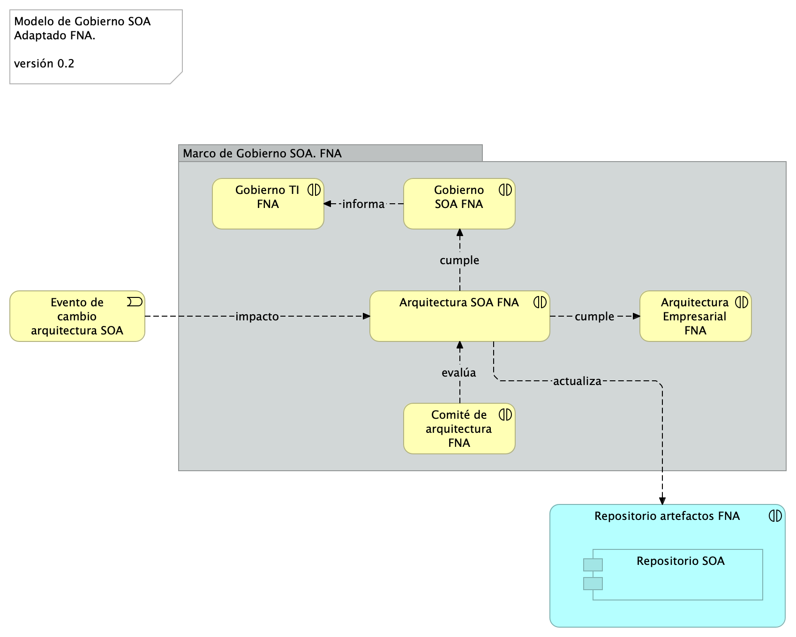

## La Oficina de Arquitectura del FNA
Es el equipo de trabajo, conforme tanto al gobierno SOA como al gobierno TIC del FNA a cargo de la creación de los diseños y la dirección de las implementaciones y transiciones que involucren soluciones de sistemas de información y aplicaciones, servicios y componentes de negocio, información negocio, y de tecnologías de infraestructura local y remota (nube). En general, la oficina de arquitectura gestiona el conocimiento de la arquitectura actual del FNA y la continuidad de la arquitectura de referencia.​

La importancia de la oficina de arquitectura está dada en tanto que materializa al gobierno del FNA, es el órgano ejecutivo de este, mediante la puesta en marcha de las funciones propias de la oficina y de las responsabilidades que gobierno le demanda. Además, realiza la necesaria articulación con otros contextos, áreas y proveedores del FNA.

En la imagen siguiente muestra la colaboración de la Oficina de Arquitectura con el modelo de gobierno del FNA (2023).

{#fig: width=}

_Fuente: Diagnóstico SOA. E-Service (2022)._

 

