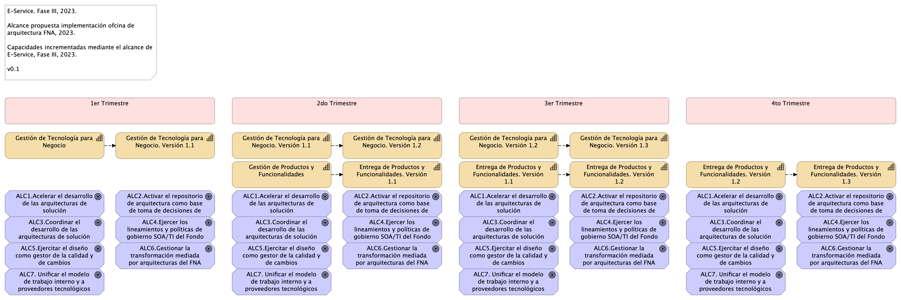

## Alcance de la Propuesta $TEMADOC
Para el período 2023, la implementación de la Oficina de arquitectura FNA impactará las capacidades Gestión de tecnología (CAP1) y de Entrega de productos y funcionalidades (CAP2)
del FNA (fuente, E-Service Fase I), _en el dominio de aplicaciones y servicios_ (restricción de alcance). Este alcance implica la planeación, ejecución y seguimiento de los actividades y objetos siguientes:

- Gestionar la transformación mediada por arquitecturas del FNA
- Activar el repositorio de arquitectura como base de toma de decisiones de cambio
- Ejercitar el diseño como gestor de la calidad y de cambios
- Coordinar el desarrollo de las arquitecturas de solución
- Unificar el modelo de trabajo interno y a proveedores tecnológicos (fábricas de software, entre otros) del FNA
- Acelerar el desarrollo de las arquitecturas de solución​
- Ejercer los lineamientos y políticas de gobierno​ SOA/TI del Fondo

 

El alcance de la primera ejecución de la hoja de ruta E-Service es el ilustrado a continuación.

{#fig:ppstaalcance.png width=}

 
