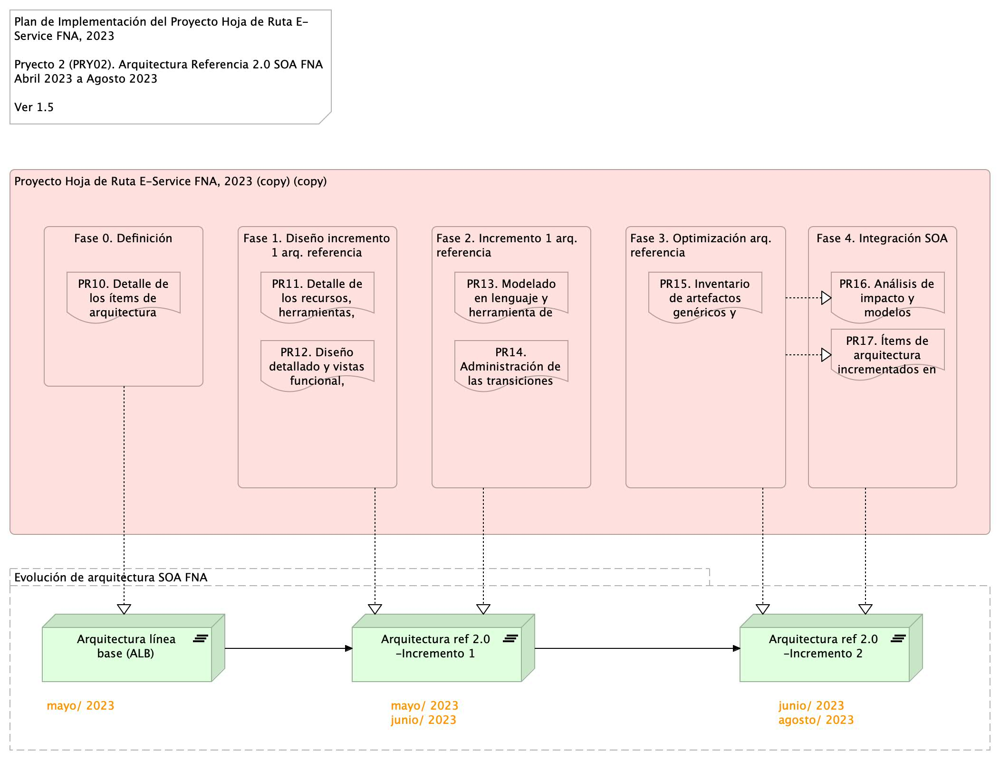

## Plan de Trabajo
Plazo de Ejecución: 5 meses, iniciado a partir del mes de abril del 2023. Equivalente en horas a 

> 180 hrs/mes * 5 meses = 910 hrs / hombre proyecto.

 

Organización de trabajo: el proyecto 2 (PRY02) inicia con la fase de Definición (DEF) en la que amplía en detalle los elementos y tecnologías de la arquitectura de referencia 2.0. Se determina además otros detalles como los elementos de la arquitectura a impactar que terminarán siendo evolucionados en los incrementos siguientes (correspondientes a las fases 2 y 3) de este mismo plan.

[Imagen 4.]() Plan de Implementación del Proyecto Hoja de Ruta E-Service FNA, 2023. Abril 2023 a Dic 2023. Ver 1.0

La fase 1 y 2, Diseño e Incremento respectiamente, tienen en realidad dos acciones: el planteamiento de la solución de la arquitectura (detalles tecnológicos), y el de la puesta en marcha de cambios mediante una implementación real de este diseño, al que llamamos arquitectura de referencia 2.0 FNA.

Las fases 3, Optimización, busca crear y gestionar el inventario de elementos genéricos de aceleración de desarollo, como funcionalidades, y artefactos de software que cumplan los estándares de la arquitetura de referencia 2.0 definida anteriormente.

Finalmente, la fase 4 se encarga de ejecutar los indicadores de medición de desempeño de los incrementos de evolución de la arquitectura de referencia 2.0.

 

