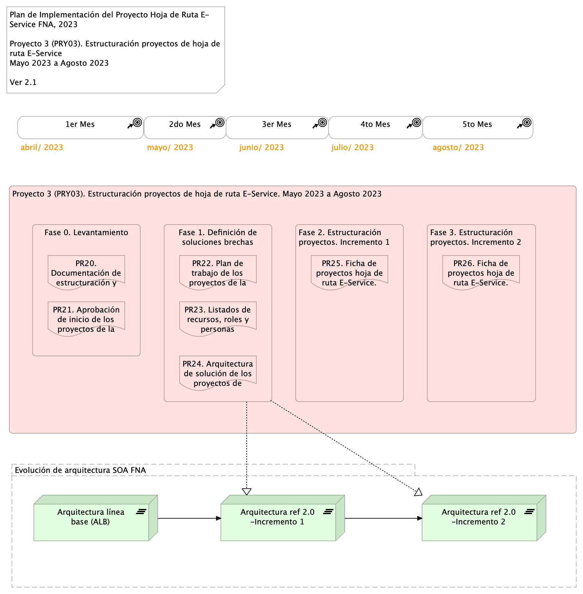

## Plan de Trabajo
Plazo de Ejecución: 4 meses, iniciado a partir del mes de abril del 2023. Equivalente en horas a 

> 180 hrs/mes * 4 meses = 720 hrs / hombre proyecto.

 

Organización de trabajo: el proyecto 3 (PRY03) inicia con la fase de Levantamiento (LVT) de los proyectos por implementar de la hoja de ruta E-Service, en coordinación con las áreas de negocio y tecnología del FNA involucradas en cada proyecto. Se determinan los detalles de los elementos de la arquitectura a impactar.

[Imagen 4.]() Plan de Implementación del Proyecto Hoja de Ruta E-Service FNA, 2023. Abril 2023 a Dic 2023. Ver 1.0

 

