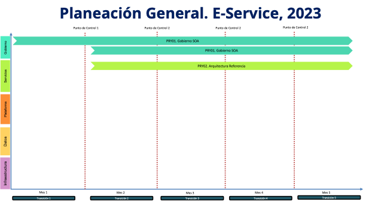

## Plan General de la Propuesta
El plan general de referencia de implementación de la actual propuesta, proyecto $PROY_DESCR, 2023, lo hemos organizado en dos componentes, o líneas de trabajo en adelante, que responden directamente a las capacidades del FNA a impactar por la propuesta. Estos es, las capacidades CAP01 Gestión de tecnología, y CAP02 Entrega de productos y funcionalidades del FNA (fuente, E-Service Fase II). Estas líneas de trabajo toman el nombre de las capacidades. La imagen siguiente resumen todo el plan, las capacidades y las líneas de trabajo relacionadas. 

    Nota: los plazos en la imagen son referenciales. Únicamente para indicar duración aproximada en cuanto son elementos para evaluar esta propuesta. Los plazos reales de cada fase del alcance, por separado, serán determinados previo a su ejecución y presentamos para aceptación.

{#fig:plangeneral.png width=}

Adicionalmente, la planeación general presenta la evolución de la arquitectura del FNA a la par del desarrollo de las líneas de trabajo del plan, Oficina Arquitectura y Transformación Arquitectura (azul y verde en la imagen). Si bien cada una de las dos líneas de trabajo son independientes, contienen fases, fechas, actividades y productos interrelacionados. 

 

### Compromisos y Entregables del Plan de Proyecto
Para el particular del Plan General presentado arriba lo pertinente es determinar las obligaciones del contratista que hace las veces de productos de trabajo a razón de que la oficina de arquitectura opera en modalidad Por Demanda.

La oficina de arquitectura del FNA, objeto de esta propuesta, cumplirá como mínimo con las obligaciones generales siguientes:

1. Elaborar y presentar un plan de trabajo junto con su aseguramiento de la calidad al inicio de los períodos de actividades consignados en el alcance del proyecto.
1. Elaborar y presentar al supervisor del contrato el detalle de la metodología que va a utilizar, las cuales deben apoyarse en estándares y arquitecturas acordados entre las partes.
1. Acordar con la gerencia de tecnología FNA la estructura y contenidos, junto con los criterios de aceptación, productos de software, componentes tecnológicos, y gestión del control de cambios de los entregables realizados durante los períodos de actividades consignados en el alcance del proyecto.
1. Disponer oportunamente de acciones de mitigación de riesgos preventivas y correctivas a lo largo del desarrollo del contrato.
1. Presentar para aprobación de la gerencia de tecnología del FNA los entregables, productos de software y demás componentes tecnológicos registrados en las obligaciones a cargo de los implementadores.
1. Asegurar la calidad de los procesos de ingeniería a su cargo, según los lineamientos del Ministerio de Tecnologías de la Información y Comunicaciones (MinTIC), y las prácticas y estándares del gobierno de arquitectura del FNA.
1. Ejecutar las acciones que gobierno de arquitectura demande a la oficina.
1. Proponer mejoras para aprobación de la gerencia de tecnología del FNA, cuando apliquen, a los documentos e información a cargo de la oficina de arquitectura.
1. Responder por aquellos actos que causen perjuicio a la gerencia de tecnología del FNA que le sean imputables.

### Fases del proyecto / Organización de trabajo
El proyecto propuesto ($PROY_DESCR) está organizado en dos (2) líneas de trabajo (horizontal en el diagrama plan general) y cuatro (4) etapas de tiempo (trimestres, en la imagen). Cada etapa ejecuta las líneas de trabajo y como resultado producirá incrementos tanto en capacidades indicadas en el alcance, como en la arquitectura del FNA.

### Plazo de Ejecución
El plazo de ejecución, contado desde la firma del contrato y de la autorización de todas las partes, es de 12 meses calendario, no horas hombre. 

Los meses de trabajo en medida de horas es el siguiente:

| Recurso           | Duración |
|-------------------|----------|
| Horas recurso 12 meses | 180 hrs/mes * 12 meses = 2.160 hrs proyecto |
| Horas recursos 12 meses | 2.160 hrs/mes * 3 recursos, equipo base = 6.840 hrs proyecto |
| Corte mensual horas recursos total mes | 6.840 hrs proyecto / 12 = 570 horas mes proyecto |

Table: Plazo de ejecución. $TEMADOC. Meses de trabajo en medida de horas. {#tbl:tblduracion-id}

 

Para efectos de facturación mensual, el trabajo en horas de la oficina asciende a 570 horas por mes durante 12 meses de duración del proyecto propuesto.

 
