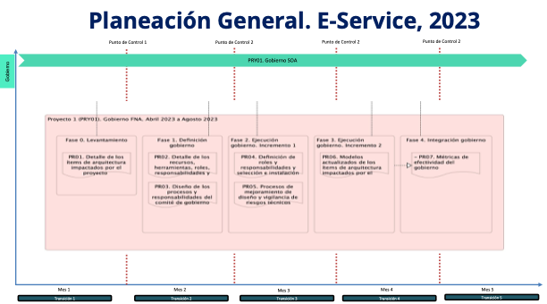

## Plan General de la Propuesta
El plan general de referencia de de la implementación de la actual propuesta, proyecto $PROY_DESCR, 2023 está resumido en la siguiente imagen. Nota: los plazos en la imagen son referenciales. Únicamente para indicar duración aproximada en cuanto son elementos para evaluar esta propuesta. Los plazos reales de cada fase del alcance, por separado, serán determinados previo a su ejecución y presentamos a aceptación.

{#fig: width=}

 

La planeación general no contiene fases ni entregables. En su lugar, cada proyecto (PRY01... 03) dentro de la planeación general es independiente y contiene fases, fechas, actividades y productos de trabajo por separado. La planeación de cada proyecto es como sigue.

[Imagen.]() Vista de tiempo de ejecución del proyecto 01 de cierre de brecha, _PRY01. Gobierno SOA FNA_, de la hoja de ruta E-Service consignados en el alcance de esta propuesta, para el período de 5 meses, en el 2023.

 
