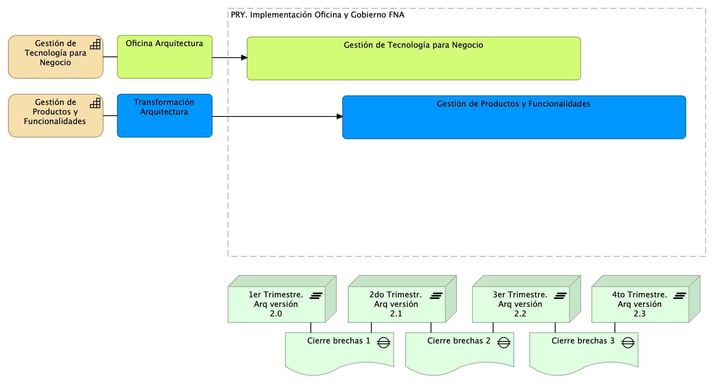

## Plan General de la Propuesta
El plan general de referencia plantea la implementación de la actual propuesta, proyecto $PROY_DESCR del 2023, se encuentra resumido en la siguiente imagen. Nota: los plazos en la imagen son referenciales. Sirve únicamente para indicar duración aproximada en cuanto que son elementos para evaluar esta propuesta. Los plazos reales de cada fase del alcance deberán ser determinados previo a su ejecución y presentados a aceptación.

{#fig:plangeneral.png width=}

La planeación general presenta la evolución de la arquitectura del FNA a la par del desarrollo de las dos líneas de trabajo que estructuran este plan: Oficina Arquitectura y Transformación Arquitectura, azul y verde en la imagen. Si bien cada una de las dos líneas de trabajo son independientes, contienen fases, fechas, actividades y productos interrelacionados. 

 

### Fases del proyecto / Organización de trabajo
El proyecto propuesto ($PROY_DESCR) está organizado en dos (2) líneas de trabajo (horizontal en el diagrama plan general) y 4 etapas de tiempo (trimestres, en la imagen) distribuidas a lo largo de un (1) año de ejecución (o 12 meses contractuales). Las etapas del plan demarcan la ejecuta de las líneas de trabajo del plan y darán como resultado los incrementos tanto en las capacidades indicadas en el alcance como en la arquitectura del FNA.

### Plazo de Ejecución
El plazo de ejecución, contado desde la firma del contrato y de la autorización de todas las partes, es de 12 meses (o un año contractual), o su equivalente en horas totales.

    horas hombre: 180 hrs/mes * 12 meses = 2.160 hrs/hombre
    horas proyecto: 2.160 hrs/hombre * 3 recursos equipo base = 6.840 hrs/proyecto

 
