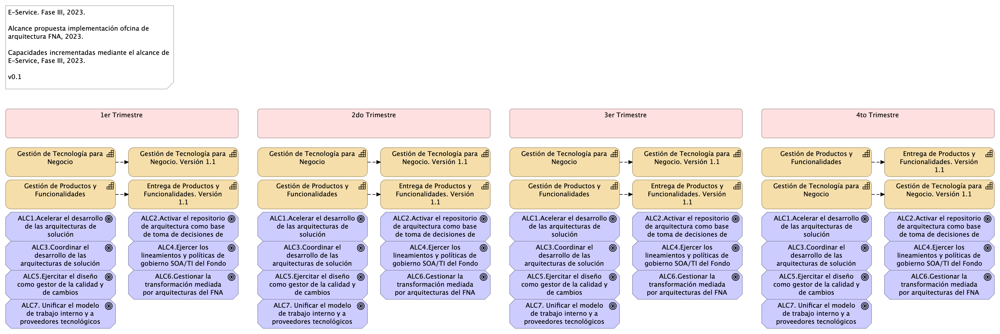

title: Propuesta de Implementación E-Service Fase 3. Oficina de Arquitectura del FNA
geometry:
  - top=1in
  - bottom=1in
fignos-cleveref: True
fignos-plus-name: Fig.
fignos-caption-name: Imagen
tablenos-caption-name: Tabla
...

<small><em>
Esta propuesta
([URL](https://hwong23.github.io/e-service/v/43872d2d994935ec6c67fb6cc7fda70fb720abf7/))
está basada en el resultado de la consultoría de arquitectura E-Service, Fase II, 2023,
[hwong23/e-service@43872d2](https://github.com/hwong23/e-service/tree/43872d2d994935ec6c67fb6cc7fda70fb720abf7)
del October 2, 2023.
</em></small>

## Autores

+ **Harry Wong, ing.**
   
    · {.inline_icon width=16 height=16}
    [e_hwong](https://github.com/e_hwong)
     
  <small>
     Arquitecto SOA, Stefanini
  </small>

::: {#correspondence}
✉ — Enviar mensajes a [GitHub Issues](https://github.com/hwong23/e-service/issues)
o correo electrónico 
Harry Wong, ing. \<e_hwong@stefanini.com\>.

:::

## Objetivo del Documento
Propuesta de implementación de la oficina de arquitectura del FNA con base en los resultados de la consultoría de arquitectura E-Service, Fase II, del 2023, realizada por  Stefanini.

|Tema            |Propuesta de Implementación de la Oficina de Arquitectura y Gobierno del FNA                                           |
|----------------|---------------------------------------------------|
|Palabras clave  |SOA, E-Service, FNA, Análisis de brecha, GAP, Comparativa          |
|Autor           |                                                   |
|Fuente          |                                                   |
|Versión|43872d2 del 02 Oct 2023                              |
|Vínculos|[N003a Vista Segmento SOA FNA](N03a%a20Vsta%20aSegenta%20SOA%20FNA.md)|

 

# Propuesta de Implementación de la Oficina de Arquitectura y Gobierno del FNA

 

## La Oficina de Arquitectura del FNA
En el contexto de la presente propuesta la oficina de arquitectura es el equipo de trabajo, conforme tanto al gobierno SOA como al gobierno TIC del FNA, a cargo de la creación de los diseños y la dirección de las implementaciones y transiciones que involucren soluciones de sistemas de información y aplicaciones, servicios y componentes de negocio, información de negocio, y de tecnologías de infraestructura local y remota (nube). En general, la oficina de arquitectura gestiona el conocimiento de la arquitectura actual del FNA y la continuidad de la arquitectura de referencia.​

El objetivo principal de la oficina de arquitectura es materializar el gobierno del FNA Mediante la puesta en marcha de las funciones propias de la oficina y de las responsabilidades que gobierno FNA le demanda. Esto se extiende hacia las articulaciones necesarias con otros contextos, áreas y proveedores del FNA. 
 
En la imagen siguiente muestra la colaboración de la Oficina de Arquitectura con el modelo de gobierno del FNA (2023).

{#fig: width=}

_Fuente: Diagnóstico SOA. E-Service (2022)._

 

## Justificación de la Propuesta Implementación de la Oficina de Arquitectura y Gobierno del FNA
La implementación de la oficina de arquitectura del FNA plantea la sistematización de la evolución de los sistemas y componentes de la empresa relevantes para el contexto de la oficina a la estrategia TI del FNA. En este sentido, la oficina promueve a los sistemas de información del FNA, junto con sus dependencias, hacia diseños y tecnologías determinadas en la arquitectura de referencia (la arquitectura de referencia del FNA fue desarrollada por esta consultoría, E-Service, Fase II, 2023), la cual incluye estilos de arquitectura orientada a eventos y tecnologías afines a esta, como microservicios, API internas y externas, infraestructura Nube, entre otras.​

#### Oportunidades / Retos
- Gestionar la transformación mediada por arquitecturas del FNA
- Activar el repositorio de arquitectura como base de toma de decisiones de cambio
- Ejercitar el diseño como gestor de la calidad y de cambios
- Coordinar el desarrollo de las arquitecturas de solución
- Unificar el modelo de trabajo interno y a proveedores tecnológicos (fábricas de software, entre otros) del FNA
- Acelerar el desarrollo de las arquitecturas de solución​
- Ejercer los lineamientos y políticas de gobierno​ SOA/TI del Fondo

#### Actores
- Áreas de negocio misionales u operativas
- Oficina de arquitectura FNA​
- Comité de arquitectura FNA​
- Consultores del FNA, proveedores tecnológicos y fábricas de software
	
#### Impacto / Beneficio
- Reducción en tiempos y costos asociados a las soluciones SOA​
- Mejora en la alineación entre negocio y TI​
- Mitigación de rotación del equipo de arquitectura​
- Visión global de soluciones de TI vs requisitos del negocio​
	
#### Tecnología
- Repositorio de Arquitectura, Mega Hopex
- Lenguaje de creción de arquitecturas, Archimate 2.0++
- Herramientas de modelado colaborativo de arquitecturas, Archi, Git
- Herramientas de generación de documentos, Mega Hopex

 

## Alcance de la Propuesta Propuesta de Implementación de la Oficina de Arquitectura y Gobierno del FNA
Para el período 2023, la implementación de la Oficina de arquitectura FNA impactará las capacidades Gestión de tecnología (CAP1) y de Entrega de productos y funcionalidades (CAP2) del FNA (fuente, E-Service Fase I) versión origen, _en el dominio de aplicaciones y servicios_ (restricción de alcance), hasta llevarlas a la versión 1.3 respectivamente. Por lo anterior, el alcance de la presente propuesta implica a la planeación, ejecución y seguimiento de las actividades tendientes a la implementación de la oficina de arquitectura del FNA, realizada mediante los siguientes objetos:

- Gestionar la transformación mediada por arquitecturas del FNA
- Activar el repositorio de arquitectura como base de toma de decisiones de cambio
- Ejercitar el diseño como gestor de la calidad y de cambios
- Coordinar el desarrollo de las arquitecturas de solución
- Unificar el modelo de trabajo interno y a proveedores tecnológicos (fábricas de software, entre otros) del FNA
- Acelerar el desarrollo de las arquitecturas de solución​
- Ejercer los lineamientos y políticas de gobierno​ SOA/TI del Fondo

 

El alcance de la propuesta actual, Propuesta de Implementación de la Oficina de Arquitectura y Gobierno del FNA, busca impactar a las capacidades hasta llevarlas a la versión 1.3. Dicho alcance es el ilustrado a continuación.

{#fig:ppstaalcance.png width=}

    Nota: para mejor apreciación, esta propuesta incluye aparte las imágenes anexas al documento. La referencia al archivo está debajo, en la descripción de cada imagen.

 

El alcance arriba consignado es rotativo por períodos. Es decir, el alcance indicado se aplica de igual manera en cada uno de los períodos de corte de la ejecución, y que en suma es la duración del proyecto presente. Para esta propuesta estos períodos son trimestrales tal como lo indica la imagen arriba. Por tanto, el alcance rotativo de este proyecto se repite en períodos trimestrales. Esta disposición del alcance permite la gestión del desempeño del proyecto al final de cada período. Todo lo anterior se traduce en la evaluación de desempeño de la oficina de arquitectura del FNA, objeto del proyecto.

 

## Plan General de la Propuesta
El plan general de referencia de implementación de la actual propuesta, proyecto Implementación de la Oficina de Arquitectura y Gobierno del FNA, 2023, lo hemos organizado en dos componentes, o líneas de trabajo en adelante, que responden directamente a las capacidades del FNA a impactar por la propuesta. Estos es, las capacidades CAP01 Gestión de tecnología, y CAP02 Entrega de productos y funcionalidades del FNA (fuente, E-Service Fase II). Estas líneas de trabajo toman el nombre de las capacidades. La imagen siguiente resumen todo el plan, las capacidades y las líneas de trabajo relacionadas. 

    Nota: los plazos en la imagen son referenciales. Únicamente para indicar duración aproximada en cuanto son elementos para evaluar esta propuesta. Los plazos reales de cada fase del alcance, por separado, serán determinados previo a su ejecución y presentamos para aceptación.

{#fig:plangeneral.png width=}

Adicionalmente, la planeación general presenta la evolución de la arquitectura del FNA a la par del desarrollo de las líneas de trabajo del plan, Oficina Arquitectura y Transformación Arquitectura (azul y verde en la imagen). Si bien cada una de las dos líneas de trabajo son independientes, contienen fases, fechas, actividades y productos interrelacionados. 

 

### Compromisos y Entregables del Plan de Proyecto
Para el particular del Plan General presentado arriba lo pertinente es determinar las obligaciones del contratista que hace las veces de productos de trabajo a razón de que la oficina de arquitectura opera en modalidad Por Demanda.

La oficina de arquitectura del FNA, objeto de esta propuesta, cumplirá como mínimo con las obligaciones generales siguientes:

1. Elaborar y presentar un plan de trabajo junto con su aseguramiento de la calidad al inicio de los períodos de actividades consignados en el alcance del proyecto.
1. Elaborar y presentar al supervisor del contrato el detalle de la metodología que va a utilizar, las cuales deben apoyarse en estándares y arquitecturas acordados entre las partes.
1. Acordar con la gerencia de tecnología FNA la estructura y contenidos, junto con los criterios de aceptación, productos de software, componentes tecnológicos, y gestión del control de cambios de los entregables realizados durante los períodos de actividades consignados en el alcance del proyecto.
1. Disponer oportunamente de acciones de mitigación de riesgos preventivas y correctivas a lo largo del desarrollo del contrato.
1. Presentar para aprobación de la gerencia de tecnología del FNA los entregables, productos de software y demás componentes tecnológicos registrados en las obligaciones a cargo de los implementadores.
1. Asegurar la calidad de los procesos de ingeniería a su cargo, según los lineamientos del Ministerio de Tecnologías de la Información y Comunicaciones (MinTIC), y las prácticas y estándares del gobierno de arquitectura del FNA.
1. Ejecutar las acciones que gobierno de arquitectura demande a la oficina.
1. Proponer mejoras para aprobación de la gerencia de tecnología del FNA, cuando apliquen, a los documentos e información a cargo de la oficina de arquitectura.
1. Responder por aquellos actos que causen perjuicio a la gerencia de tecnología del FNA que le sean imputables.

### Fases del proyecto / Organización de trabajo
El proyecto propuesto (Implementación de la Oficina de Arquitectura y Gobierno del FNA) está organizado en dos (2) líneas de trabajo (horizontal en el diagrama plan general) y cuatro (4) etapas de tiempo (trimestres, en la imagen). Cada etapa ejecuta las líneas de trabajo y como resultado producirá incrementos tanto en capacidades indicadas en el alcance, como en la arquitectura del FNA.

### Plazo de Ejecución
El plazo de ejecución, contado desde la firma del contrato y de la autorización de todas las partes, es de 12 meses calendario, no horas hombre. 

Los meses de trabajo en medida de horas es el siguiente:

| Recurso           | Duración |
|-------------------|----------|
| Horas recurso 12 meses | 180 hrs/mes * 12 meses = 2.160 hrs proyecto |
| Horas recursos 12 meses | 2.160 hrs/mes * 3 recursos, equipo base = 6.840 hrs proyecto |
| Corte mensual horas recursos total mes | 6.840 hrs proyecto / 12 = 570 horas mes proyecto |

Table: Plazo de ejecución. Propuesta de Implementación de la Oficina de Arquitectura y Gobierno del FNA. Meses de trabajo en medida de horas. {#tbl:tblduracion-id}

 

Para efectos de facturación mensual, el trabajo en horas de la oficina asciende a 570 horas por mes durante 12 meses de duración del proyecto propuesto.

 

## Equipo Base del Proyecto
|   | Recurso / ROL          | Dedicación |
|---|:-----------------------|:-----------|
| 1 | Especialista SOA 1                                                                         | Jefe Oficina de Arquitectura (FNA). Calidad del proyecto. Referente para montaje de gobierno SOA, modelamiento procesos, software y servicios  | 100%       |
|   | **Nota**: es condición del presente proyecto que este recurso sea interno FNA, por tanto, no entra en la propuesta económica presentada más adelante|                                   |            |
| 2 | Especialista Arquitectura Aplicaciones (Stefanini)              | Referente para diseño de servicios y software, modelamiento procesos, software y servicios                            | 100%       |
| 3 | Especialista Arquitectura de Datos (Stefanini)                  | Referente para diseño de entidades de datos, intercambio de información, y modelamiento de procesos y flujo de datos  | 100%       |
| 4 | Especialista Arquitectura de TI o Infraestructura (Stefanini)   | Referente para diseño de plataformas de cómputo, almacenamiento y redes, y modelamiento de ambientes de ejecución y comunicación   | 100%       |

 

#### Plan de Trabajo
Organización de trabajo: El proyecto 1 (PRY01) está organizado en 4 fases. La fase de Levantamiento (LVT) presentada abajo en la imagen determina en detalle los elementos de gobierno y de la arquitectura que se evolucionarán en los dos incrementos planteados en los proyectos del alcance consignado arriba, y que se corresponden con las fases 2 y 3 de la plan siguiente.

[Imagen.]() Plan de Implementación del Proyecto Hoja de Ruta E-Service FNA, 2023. Abril 2023 a Dic 2023. Ver 1.0

#### Fases del proyecto
La fase 1, Definición del Gobierno, diseña y determina los procesos de gestión de mejoramiento de la arquitectura SOA y la vigilancia de riesgo técnico que regirán en adelante en el FNA. Estos mismo procesos de gobierno aplican en las fases sucesivas del proyecto.

Las fases 2 y 3, implantan el gobierno anteriormente definido, e impactan directamente a los modelos y las decisiones de la arquitectura SOA del FNA, esto es, sistemas de información, herramientas de software, servicios, o componentes seleccionados en la fase Levantamiento.

Finalmente, la fase 4 se encarga de ejecutar los indicadores de medición de desempeño, tanto del gobierno como de los incrementos de evolución de la arquitectura de referencia 2.0 (ver resultados del diagnóstico E-Service, 2022).

#### Plazo de Ejecución
El plazo de ejecución, contado desde la firma del contrato y de la autorización de todas las partes, es de 5 meses, o su equivalente en horas

    180 hrs/mes * 5 meses = 910 hrs / hombre proyecto

 

## Lista de Fases y Entregables de la Propuesta
|        | PRY01. Gobierno SOA                                                                    | Documentación |
|--------|----------------------------------------------------------------------------------------|---------------|
| Fase 0 | PR01. Detalle de los ítems de arquitectura impactados por el proyecto                  |               |
|        | PR01.1. Aprobación de inicio y personal FNA asignado Gobierno SOA                      |               |
| Fase 1 | PR02. Detalle de los recursos, herramientas, roles, responsabilidades y participantes  |               |
|        | PR03. Diseño de los procesos y responsabilidades del comité de gobierno                |               |
| Fase 2 | PR04. Definición de roles y responsabilidades y selección e instalación del comité     |               |
|        | PR05. Procesos de mejoramiento de diseño y vigilancia de riesgos técnicos              |               |
| Fase 3 | PR06. Modelos actualizados de los ítems de arquitectura impactados por el proyecto     |               |
| Fase 4 | PR07. Métricas de efectividad del gobierno                                             |               |
| A      | Generar lineamientos y políticas de gobierno SOA                                       |               |
|        | Aplicar y fortalecer gobierno SOA en el FNA                                            |               |
|        | Medir las decisiones de arquitectura y del proceso de desarrollo de las soluciones SOA |               |

 

|        | PRY02. Arquitectura Referencia 2.0                                                             | Documentación |
|--------|------------------------------------------------------------------------------------------------|---------------|
| Fase 0 | PR10. Detalle de los ítems de arquitectura impactados por el proyecto                          |               |
|        | PR010.1. Aprobación de inicio y personal FNA asignado Gobierno SOA                             |               |
| Fase 1 | PR11. Detalle de los recursos, herramientas, roles, responsabilidades y participantes          |               |
|        | PR12. Diseño detallado y vistas funcional, despliegue, información, integración y tecnología  ​ |               |
| Fase 2 | PR13. Modelado en lenguaje y herramienta de diseño del FNA​                                     |               |
|        | PR14. Administración de las transiciones hacia la arquitectura versión 2.0                     |               |
| Fase 3 | PR15. Inventario de artefactos genéricos y concretos de aceleración de implementación          |               |
| Fase 4 | PR16. Análisis de impacto y modelos actualizados de los ítems de arquitectura                  |               |
|        | PR17. Ítems de arquitectura incrementados en ejecución                                         |               |
| A      | Acelerar el desarrollo de las arquitecturas de solución​                                        |               |
|        | Relacionar las implementaciones con las áreas de negocio y TI​                                  |               |
|        | Demostrar el cumplimiento de los lineamientos y políticas de gobierno​ SOA/TI del Fondo         |               |
|        | Documentación técnica en el depósito de arquitectura institucional​                             |               |

 

|        | PRY03. Estructuración de proyectos posteriores de la hoja de ruta E-Service                                 | Documentación |
|--------|-------------------------------------------------------------------------------------------------------------|---------------|
| Fase 0 | PR20. Documentación de estructuración y gestión de proyectos hoja de ruta E-Service por implementar         |               |
|        | PR20.1. Aprobación de inicio de los proyectos de la hoja de ruta E-Service                                  |               |
| Fase 1 | PR22. Plan de trabajo de los proyectos de la hoja de ruta E-Service                                         |               |
|        | PR23. Listados de recursos, roles y personas requeridas por los proyectos de la hoja de ruta E-Service      |               |
|        | PR24. Arquitectura de solución de los proyectos de cierre de brecha                                         |               |
| Fase 2 | PR25. Ficha de proyectos hoja de ruta E-Service. Incremento 1                                               |               |
| Fase 3 | PR26. Ficha de proyectos hoja de ruta E-Service. Incremento 2                                               |               |
| A      | Definición de solución de los proyectos de la hoja de ruta E-Service por implementar                        |               |
|        | Planificación de las actividades e hitos de los proyectos de la hoja de ruta E-Service                      |               |
|        | Alistamiento de ejecución de los proyectos de la hoja de ruta por implementar: recursos y equipo de trabajo |               |
|        | Aprobación de inicio de los proyectos de la hoja de ruta                                                    |               |

 

## Propuesta Económica (costo / beneficio) (aproximado)
…

 

## Consideraciones
1. Las restricciones de tiempo, esfuerzo y productos de los proyectos del alcance de esta propuesta deben ser precisadas y aprobadas en la fases de levantamiento (fase 0) respectivas.
1. Mega es la herramienta de gestión del repositorio continuo de arquitectura del FNA.
1. Los diseños y modelos de arquitectura deben seguir el estándar XMI, por tanto, otras herramientas que se adhieran este podrán complementar el repositorio de arquitectura.

## Referencias {.page_break_before}

<!-- Explicitly insert bibliography here -->

