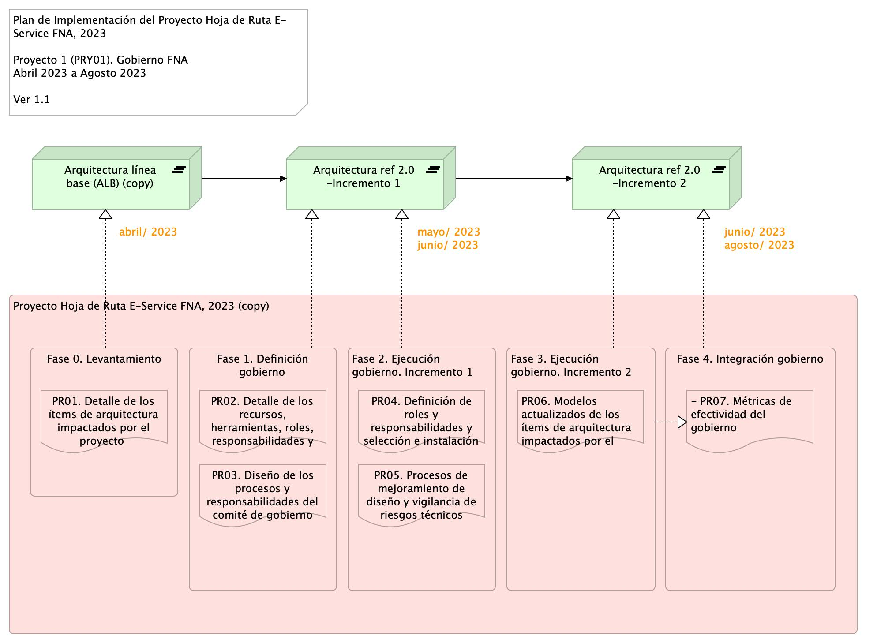
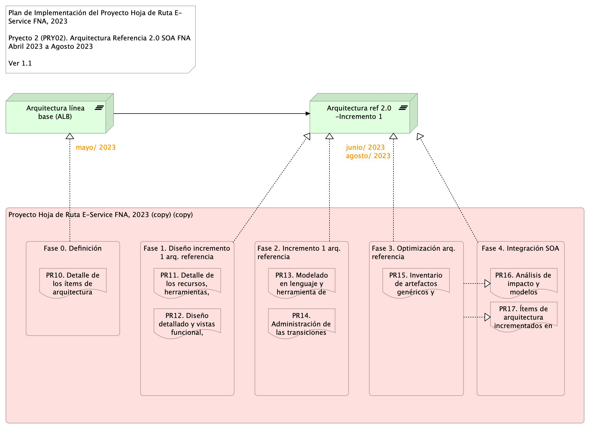
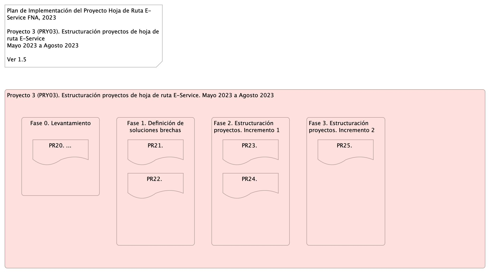

---
title: Propuesta Hoja de Ruta FNA, Período 2023
keywords:
- SOA
- madurez
- gobierno
lang: en-US
date-meta: '2023-03-30'
author-meta:
- Harry Wong, ing.
- Eddie Hernandez, ing.
- Federico Suárez, ing.
- Darío Correal, ing.
header-includes: |
  <!--
  Manubot generated metadata rendered from header-includes-template.html.
  Suggest improvements at https://github.com/manubot/manubot/blob/main/manubot/process/header-includes-template.html
  -->
  <meta name="dc.format" content="text/html" />
  <meta property="og:type" content="article" />
  <meta name="dc.title" content="Propuesta Hoja de Ruta FNA, Período 2023" />
  <meta name="citation_title" content="Propuesta Hoja de Ruta FNA, Período 2023" />
  <meta property="og:title" content="Propuesta Hoja de Ruta FNA, Período 2023" />
  <meta property="twitter:title" content="Propuesta Hoja de Ruta FNA, Período 2023" />
  <meta name="dc.date" content="2023-03-30" />
  <meta name="citation_publication_date" content="2023-03-30" />
  <meta property="article:published_time" content="2023-03-30" />
  <meta name="dc.modified" content="2023-03-30T20:42:10+00:00" />
  <meta property="article:modified_time" content="2023-03-30T20:42:10+00:00" />
  <meta name="dc.language" content="en-US" />
  <meta name="citation_language" content="en-US" />
  <meta name="dc.relation.ispartof" content="Manubot" />
  <meta name="dc.publisher" content="Manubot" />
  <meta name="citation_journal_title" content="Manubot" />
  <meta name="citation_technical_report_institution" content="Manubot" />
  <meta name="citation_author" content="Harry Wong, ing." />
  <meta name="citation_author_institution" content="Arquitecto SOA, Stefanini" />
  <meta name="citation_author" content="Eddie Hernandez, ing." />
  <meta name="citation_author_institution" content="Datos, Stefanini" />
  <meta name="citation_author" content="Federico Suárez, ing." />
  <meta name="citation_author_institution" content="Infraestructura, Stefanini" />
  <meta name="citation_author" content="Darío Correal, ing." />
  <meta name="citation_author_institution" content="Arquitecto TI, Stefanini" />
  <link rel="canonical" href="https://hwong23.github.io/e-service/" />
  <meta property="og:url" content="https://hwong23.github.io/e-service/" />
  <meta property="twitter:url" content="https://hwong23.github.io/e-service/" />
  <meta name="citation_fulltext_html_url" content="https://hwong23.github.io/e-service/" />
  <meta name="citation_pdf_url" content="https://hwong23.github.io/e-service/manuscript.pdf" />
  <link rel="alternate" type="application/pdf" href="https://hwong23.github.io/e-service/manuscript.pdf" />
  <link rel="alternate" type="text/html" href="https://hwong23.github.io/e-service/v/921b5fa4c3186dc56b0e7e196816989a5222c3c5/" />
  <meta name="manubot_html_url_versioned" content="https://hwong23.github.io/e-service/v/921b5fa4c3186dc56b0e7e196816989a5222c3c5/" />
  <meta name="manubot_pdf_url_versioned" content="https://hwong23.github.io/e-service/v/921b5fa4c3186dc56b0e7e196816989a5222c3c5/manuscript.pdf" />
  <meta property="og:type" content="article" />
  <meta property="twitter:card" content="summary_large_image" />
  <link rel="icon" type="image/png" sizes="192x192" href="https://manubot.org/favicon-192x192.png" />
  <link rel="mask-icon" href="https://manubot.org/safari-pinned-tab.svg" color="#ad1457" />
  <meta name="theme-color" content="#ad1457" />
  <!-- end Manubot generated metadata -->
bibliography:
- content/manual-references.json
manubot-output-bibliography: output/references.json
manubot-output-citekeys: output/citations.tsv
manubot-requests-cache-path: ci/cache/requests-cache
manubot-clear-requests-cache: false
...

<small><em>
This manuscript
([permalink](https://hwong23.github.io/e-service/v/921b5fa4c3186dc56b0e7e196816989a5222c3c5/))
was automatically generated
from [hwong23/e-service@921b5fa](https://github.com/hwong23/e-service/tree/921b5fa4c3186dc56b0e7e196816989a5222c3c5)
on March 30, 2023.
</em></small>

## Authors

+ **Harry Wong, ing.**
   
    · {.inline_icon width=16 height=16}
    [e_hwong](https://github.com/e_hwong)
     
  <small>
     Arquitecto SOA, Stefanini
  </small>

+ **Eddie Hernandez, ing.**
   
    · {.inline_icon width=16 height=16}
    [e_ehernandez](https://github.com/e_ehernandez)
     
  <small>
     Datos, Stefanini
  </small>

+ **Federico Suárez, ing.**
   
    · {.inline_icon width=16 height=16}
    [e_fsuarez](https://github.com/e_fsuarez)
     
  <small>
     Infraestructura, Stefanini
  </small>

+ **Darío Correal, ing.**
   
    · {.inline_icon width=16 height=16}
    [e_dcorreal](https://github.com/e_dcorreal)
     
  <small>
     Arquitecto TI, Stefanini
  </small>

::: {#correspondence}
✉ — Correspondence possible via [GitHub Issues](https://github.com/hwong23/e-service/issues)

:::

## Resumen y control de cambios {.page_break_before}

|Tema            |Portafolio de iniciativas y brechas: **Hoja de ruta de los proyectos de cambio**|
|----------------|---------------------------------------------------|
|Palabras clave  |SOA, Análisis de brecha, GAP, Comparativa          |
|Autor           |                                                   |
|Fuente          |                                                   |
|Version|921b5fa del 30 Mar 2023                              |
|Vínculos|[N003a Vista Segmento SOA FNA](N03a%a20Vsta%20aSegenta%20SOA%20FNA.md)|

 

## Hoja de Ruta E-Service FNA (Arquitectura E-Service)
Los proyectos de la hoja de ruta resultado de la ejecución de la consultoría "Arquitectura E-Service", dentro del proyecto PETI, son los siguientes:

1. Gobierno SOA
1. Oficina de arquitectura
1. Arquitectura de referencia 2.0
1. Portafolio API
1. Microservicios
1. Plataforma híbrida de integración
1. Service mesh
1. Hub de integración digital
1. Gobierno de datos
1. Gestión de datos maestros
1. Arquitectura de datos (data mesh)
1. Devops
1. Infraestructura escalable nube
1. Infraestructura autoservicio de datos

 

La secuencia, la dependencia y los plazos estimados de los proyectos de la hoja de ruta E-Service FNA es la indicada en la siguiente imagen.

[Imagen 1.]() Proyectos de cierre de brecha FNA. Prioridades, dependencias, secuencia, puntos de control de la evolución de la arquitectura de referencia SOA 2.0 del Fondo.

_Fuente: Consultoría Arquitectura E-Service._

 

## Justificación
La ejecución de la hoja de ruta E-Service (diagnóstico SOA) plantea la implementación de los proyectos de cierre de brechas que impacten a los problemas diagnosticados en dicho proyecto. Estos son: a la flexibilidad de negocio, al fortalecimiento de construcción y diseño de servicios, y a la independencia de proveedor, en el ámbito de las vicepresidencias de Crédito y de Operación, en el período de ejecución 2023.

Como resultado del inicio de la ejecución de la hoja de ruta el Fondo Nacional del Ahorro (FNA) procura 1) aumentar las capacidades de desarrollo de soluciones y requerimientos, y 2) modernizar y aumentar la capacidad del uso tecnológico de estas soluciones.

Puntualmente, la implementación (todos los proyectos) de la hoja de ruta, tal como está diagnosticada por E-Service, buscan los objetivos de (ordenados por prioridad):

* Flexibilidad y tiempo de mercado (OBJ3)
* Fortaleza SOA de las aplicaciones (OBJ2)
* Independencia de proveedor (OBJ1)

 

Para lo cual, la hoja de ruta E-Service está orientada a impactar los siguientes brechas y oportunidades:

* OP1. Instaurar la figura de gobierno SOA, capacidad, proceso y recursos
* OP2. Mejorar proceso de diseño,  construcción y DevOps de soluciones SOA
* OP3. Mejorar la oferta de servicios analíticos en segmento FNA
* OP4. Aumentar el nivel de utilización de la Tecnología SOA del FNA
* OP5. Desarrollo de Servicios FNA guiada por la arquitectura de referencia 2.0
* OP6. Gestión de la Tecnología (gobierno) orientada por arquitectura 2.0
* OP7. Articulación y fortalecimiento del equipo de arquitectura del FNA junto a proveedores
* OP8. Monitoreo de los índices de eficacia de los servicios FNA

 

## Alcance de la primera ejecución de la hoja de ruta E-Service
Para el período 2023, la implementación de la hoja de ruta E-Service impactará los objetivos de Flexibilidad (OBJ3) y Fortalecimiento (OBJ2), mediante el incremento de las capacidades del FNA 
de Gestión de tecnología (CAP1) y de Entrega de productos y funcionalidades (CAP2), en el dominio de aplicaciones y servicios únicamente. Esto implica la planeación, ejecución y seguimiento de los proyectos siguientes:

1. PRY01. Gobierno SOA FNA --Incremento 1: dominio de aplicaciones y servicios únicamente
1. PRY02. Arquitectura Referencia --Incremento 1: dominio de aplicaciones y servicios únicamente
1. PRY03. Estructuración de proyectos posteriores de la hoja de ruta E-Service

El alcance de la primera ejecución de la hoja de ruta E-Service es el ilustrado a continuación.

[Imagen 1.]() Vista de evolución de capacidades dentro del alcance del proyecto hoja de ruta E-Service, período 2023, dominio de aplicaciones y servicios. Capacidades incrementadas para impactar a los objetivos Flexibilidad (OBJ3) y Fortalecimiento (OBJ2).

 

## Proyectos del Alcance
Los proyectos PRY01, PRY02 y PRY03 de la hoja de ruta consignados en este alcance tienen por objeto cerrar las brechas de fortaleza SOA y riesgos técnicos determinados en el diagnóstico de la consultoría "Arquitectura E-Service". Estos proyectos buscan además incrementar las capacidades del FNA, CAP1 y CAP2, mencionadas en el alcance y estructurar el detalle técnico y tecnoleogico de los proyectos futuros planteadas en dicha hoja de ruta.

Las brechas en cuestión, relacionadas abajo en la imagen, son las indicadas en la justificación del presente alcance:

* Flexibilidad y tiempo de mercado (OBJ3)
* Fortaleza SOA de las aplicaciones (OBJ2)
* Independencia de proveedor (OBJ1)

[Imagen 2.]() Vista de evolución de arquitectura de referencia FNA a razón de las capacidades incrementadas mediante los proyectos de este alcance.

 

Este alcance plantea la evolución de la arquitectura de referencia 2.0 FNA en los siguientes términos.

### Arquitectura de referncia 2.0. Incremento 1
Versión mejorada de arquitectura actual SOA FNA con soporte en implementación parcial del gobierno y definiciones iniciales de la arquitectura de referencia SOA 2.0. Aplicación de arquitectura de referencia inicial a ítems seleccionados en una fase de levantamiento (LVT).

### Arquitectura de referncia 2.0. Incremento 2
Continuidad de la mejora del incremento 1. La arquitectura SOA FNA cuenta con implementación total del gobierno, una definición candidata de la arquitectura de referencia 2.0, y aplicación de la aplicación de cambios en ítems adicionales de la arquitectura actual.

 

### PRY01. Gobierno SOA FNA: dominio de aplicaciones y servicios
#### Objetivo
Definir y vigilar las relaciones entre las áreas de negocio, que para este proyecto son la vicepresidencia de operaciones y la vicepresidencia de crédito del FNA; definir y vigilar la implementación y diseño de las soluciones SOA, servicios y herramientas de software, en cumplimiento de la nueva arquitectura de referencia 2.0 del FNA. Este gobierno SOA debe asistir en la aplicación y ejecución de un estándar de implementación, observación y puesta en marcha de dichas soluciones.

 

#### Actividades
- Fortalecer el comité de gobierno SOA del FNA
- Generar lineamientos y políticas de gobierno SOA
- Medir las decisiones de arquitectura y del proceso de desarrollo de las soluciones SOA

#### Entregables
- PR01. Detalle de los ítems de arquitectura impactados por el proyecto 
- PR02. Detalle de los recursos, herramientas, roles, responsabilidades y participantes
- PR03. Diseño de los procesos y responsabilidades del comité de gobierno
- PR04. Definición de roles y responsabilidades y selección e instalación del comité
- PR05. Procesos de mejoramiento de diseño y vigilancia de riesgos técnicos
- PR06. Modelos actualizados de los ítems de arquitectura impactados por el proyecto
- PR07. Métricas de efectividad del gobierno

### Plazo de Ejecución
5 meses, iniciado a partir del mes de abril (ver plan de ejecución PRY01).

#### Impacto / Beneficio
- Lineamientos claros, libres de ambigüedad que permitan guiar y medir la evolución de la arquitectura SOA 2.0 en la organización
- Fuente única de planeación y control de las soluciones de software del FNA
- Vigilancia del cumplimiento de los niveles de servicio de las soluciones SOA​

#### Actores
- Comité de gobierno del FNA
- Oficina de arquitectura FNA
- Comité asesor 

#### Consideraciones
- MEGA: depósito centralizado de arquitectura del FNA
- Depósito documental
- Herramientas de gestión de arquitectura
- Herramientas de gestión de proyectos de tecnología

 

### Equipo Base del Proyecto
|                                         | Trabajo              | Dedicación |
|:----------------------------------------|:---------------------|:-----------|
| Director / Gerente proyecto (Stefanini) | Calidad del proyecto | 100% o 50% |
|Nota: este recurso puede ser individual, o común entre ambos proyectos del alcance|
|Especialista SOA 1, o Arquitectura empresarial (Stefanini/MEGA)|Referente para montaje de gobierno SOA, modelamiento procesos, software y servicios|100%|
|Nota: considerar un perfil parcial de apoyo al especialista SOA, experiencia en herr. MEGA|
|Especialista construcción software, servicios y componentes (Stefanini)|Referente para diseño de servicios y software, modelamiento procesos, software y servicios|100%|
|Personal del FNA|Recepción y ejecución de gobierno SOA, modelamiento software y servicios|*|
| - Especialista SOA||
| - Especialista(s) construcción software||

 

(*) La dedicación y horas de participación de los recursos internos la dispone el FNA.

 

## Plan de Trabajo
Plazo de Ejecución: 5 meses, iniciado a partir del mes de abril del 2023.

> 180 hrs/mes * 5 meses = 910 hrs / hombre proyecto.

 

Organización de trabajo: el proyecto 1 (PRY01) está organizado en 4 fases. La fase de Levantamiento (LVT) presentada abajo en la imagen determina en detalle los elementos de gobierno y de la arquitectura que se evolucionarán en los dos incrementos planteados en los proyetos del alcance consignado arriba, y que se corresponden con las fases 2 y 3 de la plan siguiente.

[Imagen 4.]() Plan de Implementación del Proyecto Hoja de Ruta E-Service FNA, 2023. Abril 2023 a Dic 2023. Ver 1.0

La fase 1, Definición del Gobierno, diseña y determina los procesos de gestión de mejoramiento de la arquitectura SOA y la vigilancia de riesgo técnico que regirán en adelante en el FNA. Estos mismo procesos de gobierno aplican en las fases sucesivas del proyecto.

Las fases 2 y 3, implantan el gobierno anteriormente definido, e impactan directamente a los modelos y las decisiones de la arquitectura SOA del FNA, esto es, sistemas de información, herramientas de software, servicios, o componentes seleccionados en la fase Levantamiento.

Finalmente, la fase 4 se encarga de ejecutar los indicadores de medición de desempeño, tanto del gobierno como de los incrementos de evolución de la arquitectura de referencia 2.0 (ver resultados del diagnóstico E-Service, 2022).

 

### PRY02. Arquitectura de referencia SOA 2.0: dominio de aplicaciones y servicios
#### Objetivo
Definir la línea base de la arquitectura de referencia 2.0 del FNA y dirigir el desarrollo de los servicios SOA del FNA hacia diseños y tecnologías determinadas en la arquitectura de referencia 2.0 (como microservicios, REST, API, infraestructura Nube, etc.) y favorecer la adopción del estilo de arquitectura orientado a eventos para atender las funcionalidades y requerimientos de negocio, que para este proyecto son la vicepresidencia de operaciones y la vicepresidencia de crédito del FNA.

 

#### Actividades
- Acelerar el desarrollo de las arquitecturas de solución​
- Relacionar las implementaciones con las áreas de negocio y TI​
- Demostrar el cumplimiento de los lineamientos y políticas de gobierno​ SOA/TI del Fondo
- Documentación técnica en el depósito de arquitectura institucional​

#### Entregables
- PR10. Detalle de los ítems de arquitectura impactados por el proyecto 
- PR11. Detalle de los recursos, herramientas, roles, responsabilidades y participantes
- PR12. Diseño detallado y vistas funcional, despliegue, información, integración y tecnología​
- PR13. Modelado en lenguaje y herramienta de diseño del FNA​
- PR14. Administración de las transiciones hacia la arquitectura versión 2.0
- PR15. Inventario de artefactos genéricos y concretos de aceleración de implementación
- PR16. Análisis de impacto y modelos actualizados de los ítems de arquitectura 
- PR17. Ítems de arquitectura incrementados en ejecución

### Plazo de Ejecución
5 meses, iniciado a partir del mes de abril (ver plan de ejecución PRY01).

#### Impacto / Beneficio
- Reducción en tiempos y costos asociados a las soluciones SOA​
- Mejora en la alineación entre negocio y TI​
- Mitigación de rotación del equipo de arquitectura​
- Visión global de soluciones de TI vs. requisitos del negocio​
	
#### Actores
- Áreas de negocio críticas​
- Oficina de arquitectura FNA​
- Consultores y equipo de apoyo​

#### Consideraciones
- Depósito´de Arquitectura
- Herramientas de modelado

 

### Equipo Base del Proyecto
|                                         | Trabajo              | Dedicación |
|:----------------------------------------|:---------------------|:-----------|
| Director / Gerente proyecto (Stefanini) | Calidad del proyecto | 100% o 50% |
|Nota: este recurso puede ser individual, o común entre ambos proyectos del alcance|
|Especialista SOA o Arquitectura de software (Stefanini)|Referente y vigilancia de implementación y diseños, modelamiento software y servicios|100%|
|Especialista construcción software, servicios y componentes (Stefanini)|Implementación y vigilancia de implementación y diseños, modelamiento software y servicios|100%|
|Personal del FNA|Recepción y ejecución de diseños, requerimientos, e implementación, SOA, modelamiento requerimientos, procesos y servicios|*|
|- Especialistas de aplicaciones pertenecientes al incremento de versión de la arquitectura FNA (ver Figura3. Aplicaciones de software del FNA involucrados en los incrementos de versión de la arquitectura de referencia)||
|- Líder funcional de aplicaciones pertenecientes al incremento de versión de la arquitectura FNA||

 

(*) La dedicación y horas de participación de los recursos internos la dispone el FNA.

 

## Plan de Trabajo
Plazo de Ejecución: 5 meses, iniciado a partir del mes de abril del 2023. Equivalente en horas a 

> 180 hrs/mes * 5 meses = 910 hrs / hombre proyecto.

 

Organización de trabajo: el proyecto 2 (PRY02) inicia con la fase de Definición (DEF) en la que amplía en detalle los elementos y tecnologías de la arquitectura de referencia 2.0. Se determina además otros detalles como los elementos de la arquitectura a impactar que terminarán siendo evolucionados en los incrementos siguientes (correspondientes a las fases 2 y 3) de este mismo plan.

[Imagen 4.]() Plan de Implementación del Proyecto Hoja de Ruta E-Service FNA, 2023. Abril 2023 a Dic 2023. Ver 1.0

La fase 1 y 2, Diseño e Incremento respectiamente, tienen en realidad dos acciones: el planteamiento de la solución de la arquitectura (detalles tecnológicos), y el de la puesta en marcha de cambios mediante una implementación real de este diseño, al que llamamos arquitectura de referencia 2.0 FNA.

Las fases 3, Optimización, busca crear y gestionar el inventario de elementos genéricos de aceleración de desarollo, como funcionalidades, y artefactos de software que cumplan los estándares de la arquitetura de referencia 2.0 definida anteriormente.

Finalmente, la fase 4 se encarga de ejecutar los indicadores de medición de desempeño de los incrementos de evolución de la arquitectura de referencia 2.0.

 

### PRY03. Gobierno SOA FNA: dominio de aplicaciones y servicios
#### Objetivo
Estructurar y detallar los proyectos de cierre de brecha de la hoja de ruta E-Service.
 

#### Actividades
- Definición de solución de los proyectos de la hoja de ruta E-Service por implementar
- Planificación de las actividades e hitos de los proyectos de la hoja de ruta E-Service
- Alistamiento de ejecución de los proyectos de la hoja de ruta por implementar: recursos y equipo de trabajo
- Aprobación de inicio de de los proyectos de la hoja de ruta

#### Entregables
- PR01. Documentación de estructuración y gestión de proyectos hoja de ruta E-Service por implementar
- PR02. Aprobación de inicio de los proyectos de la hoja de ruta E-Service
- PR03. Plan de trabajo de los proyectos de la hoja de ruta E-Service 
- PR04. Listados de recursos, roles y personas requeriras por los los proyectos de la hoja de ruta E-Service

### Plazo de Ejecución
4 meses, iniciado a partir del mes de mayo del 2023 (ver plan de ejecución PRY03).

#### Impacto / Beneficio
- Preparativos que logren la aprobación de la ejecución de los proyectos de cierre de brecha de las debilidades de arquitectura FNA.​

#### Actores
- Comité de gobierno del FNA
- Oficina de arquitectura FNA
- Personal FNA asociado por proyecto (infraestructura, Crédito, Datos, etc.)

#### Consideraciones
- MEGA: depósito centralizado de arquitectura del FNA
- Depósito documental
- Herramientas de gestión de proyectos de tecnología

 

### Equipo Base del Proyecto
|                                         | Trabajo              | Dedicación |
|:----------------------------------------|:---------------------|:-----------|
|Coordinador de proyectos principal Senior (Stefanini)|Estructuración de proyectos de la hoja de ruta E-Service|100%|
|Coordinador de proyectos auxiliar (Stefanini)||100%|
|Personal del FNA|Recepción y ejecución de diseños, requerimientos, e implementación, SOA, modelamiento requerimientos, procesos y servicios|*|
|- Especialistas de aplicaciones pertenecientes al incremento de versión de la arquitectura FNA (ver Figura3. Aplicaciones de software del FNA involucrados en los incrementos de versión de la arquitectura de referencia)||
|- Líder funcional de aplicaciones pertenecientes al incremento de versión de la arquitectura FNA||

 

(*) La dedicación y horas de participación de los recursos internos la dispone el FNA.

 

## Plan de Trabajo
Plazo de Ejecución: 4 meses, iniciado a partir del mes de abril del 2023. Equivalente en horas a 

> 180 hrs/mes * 4 meses = 720 hrs / hombre proyecto.

 

Organización de trabajo: el proyecto 3 (PRY03) inicia con la fase de Levantamiento (LVT) de los proyectos por implementar de la hoja de ruta E-Service, en coordinación con las áreas de negocio y tecnología del FNA involucradas en cada proyecto. Se determinan los detalles de los elementos de la arquitectura a impactar.

[Imagen 4.]() Plan de Implementación del Proyecto Hoja de Ruta E-Service FNA, 2023. Abril 2023 a Dic 2023. Ver 1.0

 

## Componentes modificados
Los aumentos de versión de la arquitectura SOA del FNA implica ítems de trabajo, componentes de software, aplicaciones, tecnologías o recursos de capital humano deban ser modificados (aumentado de versión).

Con propósito únicamente ilustrativo de los ítems que pueden ser sujetos de variante (especialización) por concepto de los incrementos de la arquitectura del FNA, dominio de aplicaciones y servicios únicamente, bajo las condiciones de tiempo y recursos del proyecto de implemenatción de hoja de ruta E-Service, período 2023, presentamos a continuación una lista de aplicaciones de software que pueden llegar a cambiar (otros ítems se no presentes en este ejemplo pueden ser impactados).

[Imagen 2.]() Aplicaciones de software del FNA involucrados en los incrementos de versión de la arquitectura de referencia.

 

## Entregables
Fase LVT

* Detalle de los ítems de arquitectura impactados por el proyecto 
* Detalle de los recursos, herramientas, roles, responsabilidades y participantes

Fase 1

* Procesos de mejoramiento de diseño y vigilancia de riesgos técnicos
* Modelos actualizados de los ítems de arquitectura impactados por el proyecto 

Fase 2

* ítems de arquitectura incrementados en ejecución
* Análisis de impacto y modelos actualizados de los ítems de arquitectura 

Fase 3

* ítems de arquitectura incrementados en ejecución
* Análisis de impacto y modelos actualizados de los ítems de arquitectura 

Fase 4

* Métricas de desempeño gobierno e implementación SOA
* Modelos actualizados de los ítems de arquitectura impactados por el proyecto

## Costo Beneficio (aproximado)
…

 

## Consideraciones
…

## EDT

## References {.page_break_before}

<!-- Explicitly insert bibliography here -->

