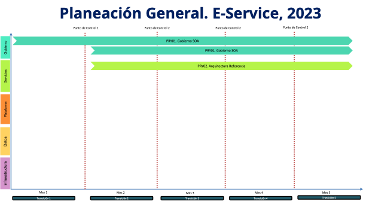
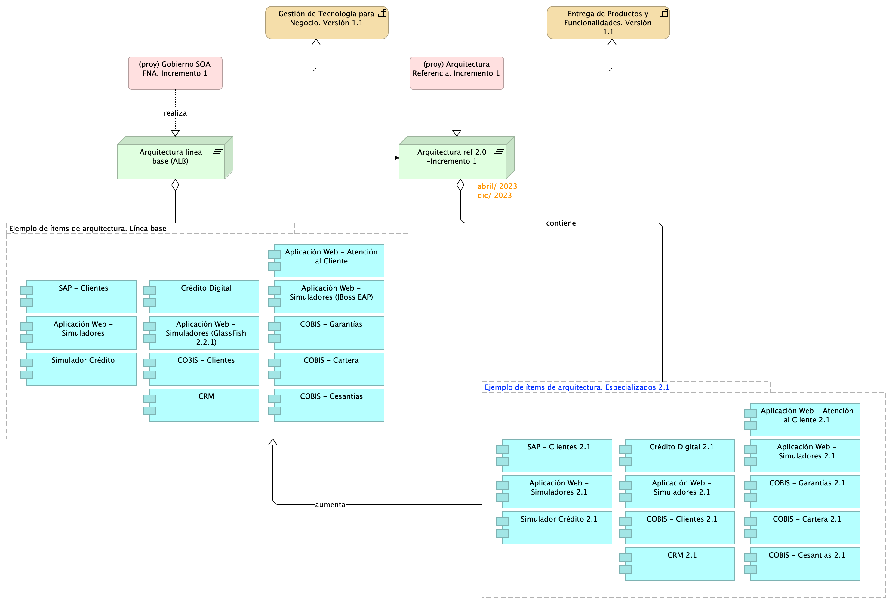

title: Propuesta de Implementación E-Service Fase 3. Oficina de Arquitectura del FNA
geometry:
  - top=1in
  - bottom=1in
fignos-cleveref: True
fignos-plus-name: Fig.
fignos-caption-name: Imagen
tablenos-caption-name: Tabla
...

<small><em>
Esta propuesta
([URL](https://hwong23.github.io/e-service/v/d9eebeed81eadbef5d4c1829cbcfb73a7d580b69/))
está basada en el resultado de la consultoría de arquitectura E-Service, Fase II, 2023,
[hwong23/e-service@d9eebee](https://github.com/hwong23/e-service/tree/d9eebeed81eadbef5d4c1829cbcfb73a7d580b69)
del September 12, 2023.
</em></small>

## Autores

+ **Harry Wong, ing.**
   
    · {.inline_icon width=16 height=16}
    [e_hwong](https://github.com/e_hwong)
     
  <small>
     Arquitecto SOA, Stefanini
  </small>

::: {#correspondence}
✉ — Enviar mensajes a [GitHub Issues](https://github.com/hwong23/e-service/issues)
o correo electrónico 
Harry Wong, ing. \<e_hwong@stefanini.com\>.

:::

## Objetivo del Documento
Propuesta de implementación de la oficina de arquitectura del FNA con base en los resultados de la consultoría de arquitectura E-Service, Fase II, del 2023, realizada por  Stefanini.

|Tema            |Propuesta de Implementación de la Oficina de Arquitectura y Gobierno del FNA                                           |
|----------------|---------------------------------------------------|
|Palabras clave  |SOA, E-Service, FNA, Análisis de brecha, GAP, Comparativa          |
|Autor           |                                                   |
|Fuente          |                                                   |
|Versión|d9eebee del 12 Sep 2023                              |
|Vínculos|[N003a Vista Segmento SOA FNA](N03a%a20Vsta%20aSegenta%20SOA%20FNA.md)|

 

# Propuesta de Implementación de la Oficina de Arquitectura y Gobierno del FNA

 

## La Oficina de Arquitectura del FNA
Es el equipo de trabajo, conforme tanto al gobierno SOA como al gobierno TIC del FNA a cargo de la creación de los diseños y la dirección de las implementaciones y transiciones que involucren soluciones de sistemas de información y aplicaciones, servicios y componentes de negocio, información negocio, y de tecnologías de infraestructura local y remota (nube). En general, la oficina de arquitectura gestiona el conocimiento de la arquitectura actual del FNA y la continuidad de la arquitectura de referencia.​

La importancia de la oficina de arquitectura está dada en tanto que materializa al gobierno del FNA mediante la ejecución de sus funciones y responsabilidades. Además, realiza la necesaria articulación con otros contextos, áreas y proveedores del FNA.

En la imagen siguiente muestra la colaboración de la Oficina de Arquitectura con el modelo de gobierno del FNA (2023).

{#fig: width=}

_Fuente: Diagnóstico SOA. E-Service (2022)._

 

## Justificación de la Propuesta
La implementación de la oficina de arquitectura del FNA plantea la sistematización de la evolución de los sistemas y componentes de la empresa en tanto relevantes a la estrategia  TI del FNA. En este sentido, la oficina promueve a los sistemas de información del FNA, junto con sus dependencias, hacia diseños y tecnologías determinadas en la arquitectura de referencia (la arquitectura de referencia del FNA fue desarrollada por esta consultoría, E-Service, Fase II, 2023), la cual incluye estilos de arquitectura orientada a eventos y tecnologías afines a esta, como microservicios, API internas y externas, infraestructura Nube, entre otras.​

#### Oportunidades / Retos
- Gestionar la transformación mediada por arquitecturas del FNA
- Activar el repositorio de arquitectura como base de toma de decisiones de cambio
- Ejercitar el diseño como gestor de la calidad y de cambios
- Coordinar el desarrollo de las arquitecturas de solución
- Unificar el modelo de trabajo interno y a proveedores tecnológicos (fábricas de software, entre otros) del FNA
- Acelerar el desarrollo de las arquitecturas de solución​
- Ejercer los lineamientos y políticas de gobierno​ SOA/TI del Fondo

#### Actores
- Áreas de negocio críticas​
- Oficina de arquitectura FNA​
- Consultores y equipo de apoyo​
	
#### Impacto / Beneficio
- Reducción en tiempos y costos asociados a las soluciones SOA​
- Mejora en la alineación entre negocio y TI​
- Mitigación de rotación del equipo de arquitectura​
- Visión global de soluciones de TI vs requisitos del negocio​
	
#### Tecnología
- Repositorio de Arquitectura, Mega Hopex
- Herramientas de modelado colaborativo, Archimate
- Herramientas de generación de documentos, jArchi

 

## Alcance de la Propuesta Propuesta de Implementación de la Oficina de Arquitectura y Gobierno del FNA
Para el período 2023, la implementación de la Oficina de arquitectura FNA impactará las capacidades Gestión de tecnología (CAP1) y de Entrega de productos y funcionalidades (CAP2)
del FNA (fuente, E-Service Fase I) versión origen, _en el dominio de aplicaciones y servicios_ (restricción de alcance), hasta llevarlas a la versión 1.3 respectivamente. Este alcance implica la planeación, ejecución y seguimiento de los actividades y objetos siguientes:

- Gestionar la transformación mediada por arquitecturas del FNA
- Activar el repositorio de arquitectura como base de toma de decisiones de cambio
- Ejercitar el diseño como gestor de la calidad y de cambios
- Coordinar el desarrollo de las arquitecturas de solución
- Unificar el modelo de trabajo interno y a proveedores tecnológicos (fábricas de software, entre otros) del FNA
- Acelerar el desarrollo de las arquitecturas de solución​
- Ejercer los lineamientos y políticas de gobierno​ SOA/TI del Fondo

 

El alcance de la propuesta actual, Propuesta de Implementación de la Oficina de Arquitectura y Gobierno del FNA, que busca impactar a las capacidades hasta llevarlas a la versión 1.3 es el ilustrado a continuación.

{#fig:ppstaalcance.png width=}

 

## Plan General de la Propuesta
El plan general de referencia de de la implementación de la actual propuesta, proyecto Implementación de la Oficina de Arquitectura y Gobierno del FNA, 2023 está resumido en la siguiente imagen. Nota: los plazos en la imagen son referenciales. Únicamente para indicar duración aproximada en cuanto son elementos para evaluar esta propuesta. Los plazos reales de cada fase del alcance, por separado, serán determinados previo a su ejecución y presentamos a aceptación.

{#fig:plangeneral.png width=}

 

La planeación general presenta la evolución de la arquitectura del FNA a la par del desarrollo de las dos líneas de trabajo del plan, Oficina Arquitectura y Transformación Arquitectura, azul y verde en la imagen. Si bien cada una de las dos líneas de trabajo son independientes, contienen fases, fechas, actividades y productos interrelacionados. 

 

### PRY01. Implementación de la Oficina de Arquitectura y Gobierno del FNA
#### Objetivo
Definir y vigilar las relaciones entre las áreas de negocio, que para este proyecto son la vicepresidencia de operaciones y la vicepresidencia de crédito del FNA; definir y vigilar la implementación y diseño de las soluciones SOA, servicios y herramientas de software, en cumplimiento de la nueva arquitectura de referencia 2.0 del FNA. Este gobierno SOA debe asistir en la aplicación y ejecución de un estándar de implementación, observación y puesta en marcha de dichas soluciones.

 

#### Alcance
- Crear e institucionalizar el comité de gobierno SOA del FNA
- Definir los roles y responsabilidades para la instalación del comité
- Elaborar los lineamientos, políticas  y procesos de gobierno SOA del FNA
- Medir las decisiones de gobierno sobre la arquitectura y el proceso de desarrollo de soluciones SOA

#### Actividades
1. Generar lineamientos y políticas de gobierno SOA
1. Aplicar y fortalecer gobierno SOA en el FNA
1. Relacionar el gobierno SOA con gestión de modelos y repositorio de arquitectura del FNA
1. Medir las decisiones de arquitectura y del proceso de desarrollo de las soluciones SOA

#### Fases y Entregables
- Fase 0. Definición
    - PR01. Detalle de los ítems de arquitectura impactados por el proyecto
    - PR01.1. Aprobación de inicio y personal FNA asignado Gobierno SOA
- Fase 1. Definición gobierno
    - PR02. Detalle de los recursos, herramientas, roles, responsabilidades y participantes
    - PR03. Diseño de los procesos y responsabilidades del comité de gobierno
- Fase 2. Ejecución gobierno. Incremento 1
    - PR04. Definición de roles y responsabilidades y selección e instalación del comité
    - PR05. Procesos de mejoramiento de diseño y vigilancia de riesgos técnicos
- Fase 3. Ejecución gobierno. Incremento 2
    - PR06. Modelos actualizados de los ítems de arquitectura impactados por el proyecto
- Fase 4. Integración gobierno
    - PR07. Métricas de efectividad del gobierno

#### Plazo de Ejecución
3 meses, iniciado a partir del mes de mayo del 2023 (ver Plan de Ejecución PRY01, más adelante).

#### Impacto / Beneficio
- Lineamientos claros, libres de ambigüedad que permitan guiar y medir la evolución de la arquitectura SOA 2.0 en la organización
- Fuente única de planeación y control de las soluciones de software del FNA
- Vigilancia del cumplimiento de los niveles de servicio de las soluciones SOA​

#### Actores
- Comité de gobierno del FNA
- Oficina de arquitectura FNA
- Comité asesor 

#### Consideraciones
- MEGA: depósito centralizado de arquitectura del FNA
- Depósito documental
- Herramientas de gestión de arquitectura
- Herramientas de gestión de proyectos de tecnología

 

#### Equipo Base del Proyecto
|   |                                                                                            | Trabajo                                                                                    | Dedicación |
|---|:-------------------------------------------------------------------------------------------|:-------------------------------------------------------------------------------------------|:-----------|
| 1 | Director / Gerente proyecto (Stefanini)                                                    | Calidad del proyecto                                                                       | 100% o 50% |
|   | Nota: este recurso puede ser individual, o común entre ambos proyectos del alcance         |                                                                                            |            |
| 2 | Especialista SOA 1, o Arquitectura empresarial (Stefanini/MEGA)                            | Referente para montaje de gobierno SOA, modelamiento procesos, software y servicios        | 100%       |
|   | Nota: considerar un perfil parcial de apoyo al especialista SOA, experiencia en herr. MEGA |                                                                                            |            |
| 3 | Especialista construcción software, servicios y componentes (Stefanini)                    | Referente para diseño de servicios y software, modelamiento procesos, software y servicios | 100%       |
|   | Personal del FNA                                                                           | Recepción y ejecución de gobierno SOA, modelamiento software y servicios                   | *          |
|   | - Especialista SOA                                                                         |                                                                                            |            |
|   | - Especialista(s) construcción software                                                    |                                                                                            |            |

 

(*) La dedicación y horas de participación de los recursos internos la dispone el FNA.

 

#### Plan de Trabajo
Organización de trabajo: El proyecto 1 (PRY01) está organizado en 4 fases. La fase de Levantamiento (LVT) presentada abajo en la imagen determina en detalle los elementos de gobierno y de la arquitectura que se evolucionarán en los dos incrementos planteados en los proyectos del alcance consignado arriba, y que se corresponden con las fases 2 y 3 de la plan siguiente.

[Imagen.]() Plan de Implementación del Proyecto Hoja de Ruta E-Service FNA, 2023. Abril 2023 a Dic 2023. Ver 1.0

#### Fases del proyecto
La fase 1, Definición del Gobierno, diseña y determina los procesos de gestión de mejoramiento de la arquitectura SOA y la vigilancia de riesgo técnico que regirán en adelante en el FNA. Estos mismo procesos de gobierno aplican en las fases sucesivas del proyecto.

Las fases 2 y 3, implantan el gobierno anteriormente definido, e impactan directamente a los modelos y las decisiones de la arquitectura SOA del FNA, esto es, sistemas de información, herramientas de software, servicios, o componentes seleccionados en la fase Levantamiento.

Finalmente, la fase 4 se encarga de ejecutar los indicadores de medición de desempeño, tanto del gobierno como de los incrementos de evolución de la arquitectura de referencia 2.0 (ver resultados del diagnóstico E-Service, 2022).

#### Plazo de Ejecución
El plazo de ejecución, contado desde la firma del contrato y de la autorización de todas las partes, es de 5 meses, o su equivalente en horas

    180 hrs/mes * 5 meses = 910 hrs / hombre proyecto

 

## Componentes de la Arquitectura FNA Impactados
Los aumentos de versión de la arquitectura SOA del FNA implica ítems de trabajo, componentes de software, aplicaciones, tecnologías o recursos de capital humano deban ser modificados (aumentado de versión).

Con propósito únicamente ilustrativo de los ítems que pueden ser sujetos de variante (especialización) por concepto de los incrementos de la arquitectura del FNA, dominio de aplicaciones y servicios únicamente, bajo las condiciones de tiempo y recursos del proyecto de implementación de hoja de ruta E-Service, período 2023, presentamos a continuación una lista de aplicaciones de software que pueden llegar a cambiar (otros ítems no presentes en este ejemplo pueden ser impactados).

[Imagen 2.]() Aplicaciones de software del FNA involucrados en los incrementos de versión de la arquitectura de referencia.

 

## Lista de Fases y Entregables de la Propuesta
|        | PRY01. Gobierno SOA                                                                    | Documentación |
|--------|----------------------------------------------------------------------------------------|---------------|
| Fase 0 | PR01. Detalle de los ítems de arquitectura impactados por el proyecto                  |               |
|        | PR01.1. Aprobación de inicio y personal FNA asignado Gobierno SOA                      |               |
| Fase 1 | PR02. Detalle de los recursos, herramientas, roles, responsabilidades y participantes  |               |
|        | PR03. Diseño de los procesos y responsabilidades del comité de gobierno                |               |
| Fase 2 | PR04. Definición de roles y responsabilidades y selección e instalación del comité     |               |
|        | PR05. Procesos de mejoramiento de diseño y vigilancia de riesgos técnicos              |               |
| Fase 3 | PR06. Modelos actualizados de los ítems de arquitectura impactados por el proyecto     |               |
| Fase 4 | PR07. Métricas de efectividad del gobierno                                             |               |
| A      | Generar lineamientos y políticas de gobierno SOA                                       |               |
|        | Aplicar y fortalecer gobierno SOA en el FNA                                            |               |
|        | Medir las decisiones de arquitectura y del proceso de desarrollo de las soluciones SOA |               |

 

|        | PRY02. Arquitectura Referencia 2.0                                                             | Documentación |
|--------|------------------------------------------------------------------------------------------------|---------------|
| Fase 0 | PR10. Detalle de los ítems de arquitectura impactados por el proyecto                          |               |
|        | PR010.1. Aprobación de inicio y personal FNA asignado Gobierno SOA                             |               |
| Fase 1 | PR11. Detalle de los recursos, herramientas, roles, responsabilidades y participantes          |               |
|        | PR12. Diseño detallado y vistas funcional, despliegue, información, integración y tecnología  ​ |               |
| Fase 2 | PR13. Modelado en lenguaje y herramienta de diseño del FNA​                                     |               |
|        | PR14. Administración de las transiciones hacia la arquitectura versión 2.0                     |               |
| Fase 3 | PR15. Inventario de artefactos genéricos y concretos de aceleración de implementación          |               |
| Fase 4 | PR16. Análisis de impacto y modelos actualizados de los ítems de arquitectura                  |               |
|        | PR17. Ítems de arquitectura incrementados en ejecución                                         |               |
| A      | Acelerar el desarrollo de las arquitecturas de solución​                                        |               |
|        | Relacionar las implementaciones con las áreas de negocio y TI​                                  |               |
|        | Demostrar el cumplimiento de los lineamientos y políticas de gobierno​ SOA/TI del Fondo         |               |
|        | Documentación técnica en el depósito de arquitectura institucional​                             |               |

 

|        | PRY03. Estructuración de proyectos posteriores de la hoja de ruta E-Service                                 | Documentación |
|--------|-------------------------------------------------------------------------------------------------------------|---------------|
| Fase 0 | PR20. Documentación de estructuración y gestión de proyectos hoja de ruta E-Service por implementar         |               |
|        | PR20.1. Aprobación de inicio de los proyectos de la hoja de ruta E-Service                                  |               |
| Fase 1 | PR22. Plan de trabajo de los proyectos de la hoja de ruta E-Service                                         |               |
|        | PR23. Listados de recursos, roles y personas requeridas por los proyectos de la hoja de ruta E-Service      |               |
|        | PR24. Arquitectura de solución de los proyectos de cierre de brecha                                         |               |
| Fase 2 | PR25. Ficha de proyectos hoja de ruta E-Service. Incremento 1                                               |               |
| Fase 3 | PR26. Ficha de proyectos hoja de ruta E-Service. Incremento 2                                               |               |
| A      | Definición de solución de los proyectos de la hoja de ruta E-Service por implementar                        |               |
|        | Planificación de las actividades e hitos de los proyectos de la hoja de ruta E-Service                      |               |
|        | Alistamiento de ejecución de los proyectos de la hoja de ruta por implementar: recursos y equipo de trabajo |               |
|        | Aprobación de inicio de los proyectos de la hoja de ruta                                                    |               |

 

## Propuesta Económica (costo / beneficio) (aproximado)
…

 

## Consideraciones
1. Las restricciones de tiempo, esfuerzo y productos de los proyectos del alcance de esta propuesta deben ser precisadas y aprobadas en la fases de levantamiento (fase 0) respectivas.
1. Mega es la herramienta de gestión del repositorio continuo de arquitectura de referencia del FNA.
1. Los diseños y modelos de arquitectura deben seguir el estándar XMI, por tanto, otras herramientas que se adhieran este podrán complementar el repositorio de arquitectura.

## EDT

## Referencias {.page_break_before}

<!-- Explicitly insert bibliography here -->

